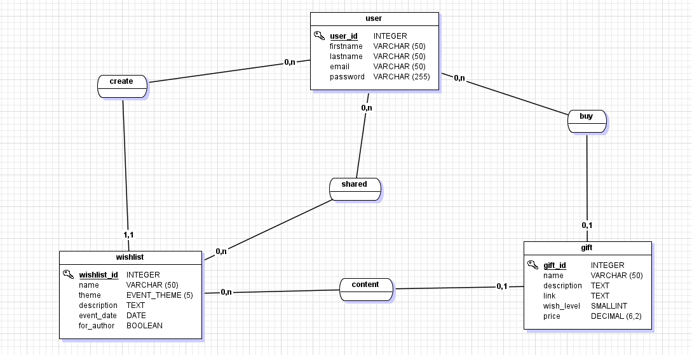
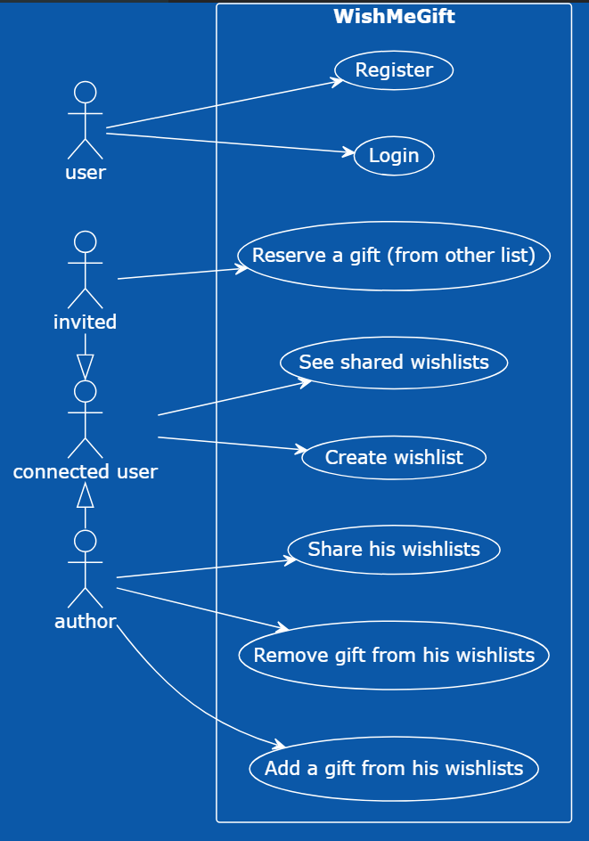

# Descrpition du projet : WishMeGift

## BASE DE DONNEES

### Conception du MCD

### Conception du MLD

## USER STORIES

| ID | En tant que | Action | Afin de |
| -- | ----------- | ------ | ------- |
| US01 | Utilisateur connecté | créer une liste de souhaits | décrire ce que je veux |
| US02 | Utilisateur qui à créer une liste | ajouter des cadeaux de la liste | compléter ma liste |
| US03 | Auteur | administrer une liste | ajouter modifier ou d'enlever une ou plusieurs liste |
| US04 | Auteur | administrer les cadeaux | ajouter modifier ou d'enlever un ou plusieurs cadeaux dans une liste |
| US05 | Utilisateur | créer un compte (simulation) | pour pouvoir se connecter |
| US06 | Utilisateur | se connecter(simulation) | afin de créer ou consulter une listes |
| US07 | Utilisateur connecté | partager une liste de souhaits | pouvoir partager mes souhaits |
| US08 | Utilisateur connecté | voir les listes de souhaits partagées | consulter les différentes listes qui lui ont été partagées |
| US09 | Utilisateur connecté | réserver un cadeau d'une liste | |

Version PlantUML :

[Lien du PlantUML](./readme_assets/userstories_plantuml_code.md.txt)

Lien pour voir la doc de la liste des Endpoints : http://localhost:8080/swagger-ui/index.html#
